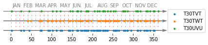

# Drawing a timeline displaying (satellite) acquisition dates

This code provides a (naïve) tool to draw a timeline that displays acquisition dates for a single area

or for multiple areas (below Sentinel-2 acquisition dates over three tiles)

The red dashed lines represent interpolated dates (used to deal with irregular temporal sampling for example).

It might be used to present your (remote sensing) dataset.

## Usage
This code relies on Pyhton 3.7.

Please have a look to the Jupyter notebook `draw-timeline.ipynb` to draw your own timelines.

## Contributors
 - [Dr. Charlotte Pelletier](https://sites.google.com/site/charpelletier) - Ass. Professor in computer science at Univ. Bretagne Sud / IRISA
 
## License
[GNU AGPLv3](https://choosealicense.com/licenses/agpl-3.0/)
